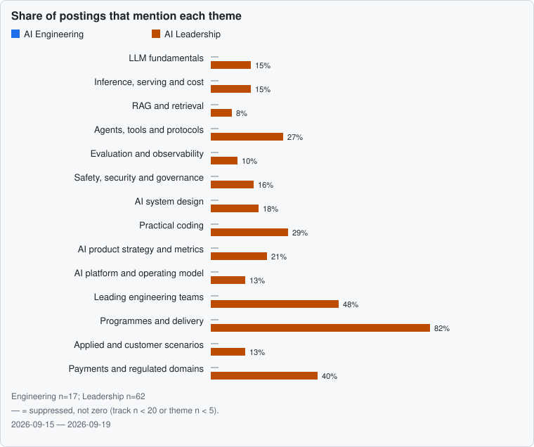

<!-- Generated by scripts/build.py from src/content. Edit the YAML, not this file. -->
# AI Interview Atlas

English · [Русский](README.ru.md)

Sourced interview questions and interview loops for AI leadership — product managers, engineering managers, directors and technical programme managers — and for AI engineering. Every company claim and every reported question carries a source and the date it was read; questions written from job-posting themes are labelled as generated, and answers are written out rather than linked to a course.

**Questions: 255 (engineering 191, leadership 146) · companies: 20 · sources: 107 · updated 2026-09-26**

## How to use it

1. Pick your track: **AI Engineering** or **AI Leadership**. The track pages below list the roles each one covers.
2. Work through *Start here* for your track, then the themes where the [requirements radar](docs/radar.md) shows the most demand.
3. Before an interview, open the company page: loop stages with their basis, the coding requirement and the questions reported for that company.
4. Practise aloud. Every question says what it tests; priority questions also have answer checklists and reading. Use those as prompts for reasoning, not scripts.

Markers: ✅ confirmed by the company · 🗣 candidate report · † prep guide or compilation without a first-hand source · 🧪 generated from job-posting themes. Interview loops change often, so check the retrieval date.

## Tracks and roles

- **AI Engineering.** Engineers who build, ship and run AI systems: applications, agents, platforms, inference and research code.
  - Software engineer (general interview baseline), AI / LLM engineer, Software engineer on AI products, Applied AI / forward-deployed engineer, Agent engineer, AI platform / MLOps engineer, Inference and performance engineer, Research engineer
- **AI Leadership.** People who decide what AI to build and lead the teams, programmes and organisations that build it.
  - Product manager (general interview baseline), AI product manager (senior to group), Director or head of product, Engineering manager, Director or head of engineering, Technical program manager, AI platform lead, Head of AI adoption / chief AI officer, Forward-deployed or solutions leader

## Start here: AI Engineering

- **Derive scaled dot-product attention and explain how its scale affects softmax gradients.**
  - Knowledge · [LLM fundamentals](docs/themes/llm-fundamentals.md)
- **Derive the memory required by a decoder's KV cache as batch size and context length grow.**
  - Knowledge · [LLM fundamentals](docs/themes/llm-fundamentals.md) · Asked at: [Amazon](docs/companies/amazon.md) †, [OpenAI](docs/companies/openai.md) †
- **Compare multi-head, multi-query and grouped-query attention in quality and serving memory.**
  - Knowledge · [LLM fundamentals](docs/themes/llm-fundamentals.md) · Asked at: [Meta](docs/companies/meta.md) †
- **Under a fixed training compute budget, how do Chinchilla-style scaling results change the balance between model size and training tokens?**
  - Knowledge · [LLM fundamentals](docs/themes/llm-fundamentals.md) · Asked at: [Anthropic](docs/companies/anthropic.md) †
- **How would you test and reduce a model's tendency to miss relevant evidence in the middle of a long context?**
  - Knowledge · [LLM fundamentals](docs/themes/llm-fundamentals.md)
- **Contrast prefill with autoregressive decode and explain when compute or memory bandwidth becomes the bottleneck.**
  - Knowledge · [Inference, serving and cost](docs/themes/inference-economics.md)
- **Explain iteration-level batching and how requests enter and leave a running inference batch.**
  - Knowledge · [Inference, serving and cost](docs/themes/inference-economics.md) · Asked at: [Anthropic](docs/companies/anthropic.md) †
- **Explain exact speculative decoding, its acceptance step and workloads where the draft model adds overhead instead of speed.**
  - Knowledge · [Inference, serving and cost](docs/themes/inference-economics.md)
- **Estimate a serving memory budget for a 70-billion-parameter model, explicitly choosing precision, context and concurrency assumptions.**
  - Applied scenario · [Inference, serving and cost](docs/themes/inference-economics.md)
- **You are asked to reduce serving cost by an order of magnitude. Rank the levers and explain how you would test whether that target is achievable.**
  - Applied scenario · [Inference, serving and cost](docs/themes/inference-economics.md) · Asked at: [Amazon](docs/companies/amazon.md) †, [Microsoft](docs/companies/microsoft.md) †
- **After a deployment, p99 latency doubles although model weights are unchanged. How do you isolate the cause?**
  - Applied scenario · [Inference, serving and cost](docs/themes/inference-economics.md) · Asked at: [Amazon](docs/companies/amazon.md) †, [Databricks](docs/companies/databricks.md) †, [OpenAI](docs/companies/openai.md) †, [Perplexity](docs/companies/perplexity.md) †
- **Choose a chunking approach for technical documentation, including how you preserve meaning across section boundaries.**
  - Applied scenario · [RAG and retrieval](docs/themes/rag-retrieval.md)
- **When would you combine lexical and dense retrieval, and how would you merge their rankings?**
  - Knowledge · [RAG and retrieval](docs/themes/rag-retrieval.md) · Asked at: [Microsoft](docs/companies/microsoft.md) †, [Perplexity](docs/companies/perplexity.md) †
- **How would you separately evaluate document retrieval and answer generation in a RAG application?**
  - Applied scenario · [RAG and retrieval](docs/themes/rag-retrieval.md)
- **Design retrieval that enforces the source system's access rights, including permission changes and shared caches.**
  - System design · [RAG and retrieval](docs/themes/rag-retrieval.md) · Asked at: [Databricks](docs/companies/databricks.md) †, [Microsoft](docs/companies/microsoft.md) †, [Palantir](docs/companies/palantir.md) †
- **Compare exact search, HNSW and IVF-PQ for an embedding index under memory, recall and latency constraints.**
  - Knowledge · [RAG and retrieval](docs/themes/rag-retrieval.md)
- **What does interleaving reasoning with tool observations add to a language-model agent compared with reasoning alone?**
  - Knowledge · [Agents, tools and protocols](docs/themes/agents-tools.md)
- **Design recovery from tool errors and timeouts, including cases where a timed-out call may already have changed external state.**
  - System design · [Agents, tools and protocols](docs/themes/agents-tools.md) · Asked at: [OpenAI](docs/companies/openai.md) †
- **How would you select, name and document tools so that a model chooses the right operation and arguments?**
  - System design · [Agents, tools and protocols](docs/themes/agents-tools.md) · Asked at: [Anthropic](docs/companies/anthropic.md) †
- **Define completion and stopping conditions for an agent loop so it cannot spend indefinitely on an unfinished task.**
  - System design · [Agents, tools and protocols](docs/themes/agents-tools.md)
- **Design human approval for consequential agent actions, including how approval remains bound to the exact action being executed.**
  - System design · [Agents, tools and protocols](docs/themes/agents-tools.md) · Asked at: [OpenAI](docs/companies/openai.md) †, [Palantir](docs/companies/palantir.md) †
- **Walk through a preference-based RLHF pipeline and explain the roles of the reward model and reference-policy penalty.**
  - Knowledge · [Fine-tuning and post-training](docs/themes/post-training.md)
- **Compare DPO with PPO-based RLHF, including the assumptions behind offline preference learning and reasons to collect fresh rollouts.**
  - Knowledge · [Fine-tuning and post-training](docs/themes/post-training.md)
- **Derive the low-rank weight update used by LoRA and propose an experiment for choosing its rank.**
  - Knowledge · [Fine-tuning and post-training](docs/themes/post-training.md)
- **How does QLoRA reduce finetuning memory, and which tensors remain trainable or require higher precision?**
  - Knowledge · [Fine-tuning and post-training](docs/themes/post-training.md)
- **Choose between prompt changes, retrieval and finetuning for a failing AI feature; include data freshness, latency and total cost.**
  - Applied scenario · [Fine-tuning and post-training](docs/themes/post-training.md) · Asked at: [Databricks](docs/companies/databricks.md) †, [Microsoft](docs/companies/microsoft.md) †, [OpenAI](docs/companies/openai.md) †
- **Design an LLM judge and a calibration process that exposes order, verbosity and self-preference biases.**
  - System design · [Evaluation and observability](docs/themes/evals-observability.md) · Asked at: [Perplexity](docs/companies/perplexity.md) †
- **Design a release gate for prompt and model updates, including what happens when aggregate gains hide a critical regression.**
  - System design · [Evaluation and observability](docs/themes/evals-observability.md) · Asked at: [Anthropic](docs/companies/anthropic.md) †
- **Benchmark results improve but users report a worse product. What hypotheses would you test first?**
  - Applied scenario · [Evaluation and observability](docs/themes/evals-observability.md)
- **Design observability for a production LLM workflow: which spans, versions, costs and feedback should be linked?**
  - System design · [Evaluation and observability](docs/themes/evals-observability.md)
- **How should evaluation of a tool-using agent differ from grading one generated response?**
  - System design · [Evaluation and observability](docs/themes/evals-observability.md)
- **Compare projection layers, cross-attention and token-based integration for giving a language model access to images.**
  - Knowledge · [Multimodal and voice](docs/themes/multimodal-voice.md) · Asked at: [Meta](docs/companies/meta.md) †
- **How would you improve and evaluate speech recognition for mixed-language utterances and different accents?**
  - Applied scenario · [Multimodal and voice](docs/themes/multimodal-voice.md)
- **Design a knowledge assistant over ten million enterprise documents with per-user permissions and a continuously changing corpus.**
  - System design · [AI system design](docs/themes/ai-system-design.md) · Asked at: [Amazon](docs/companies/amazon.md) †, [Databricks](docs/companies/databricks.md) †, [Microsoft](docs/companies/microsoft.md) †, [OpenAI](docs/companies/openai.md) †
- **Design an LLM gateway with provider routing, failover, caching, rate limits and enforceable spending budgets.**
  - System design · [AI system design](docs/themes/ai-system-design.md) · Asked at: [Palantir](docs/companies/palantir.md) †, [Perplexity](docs/companies/perplexity.md) †
- **Design a customer-support agent that can execute service actions and transfer the case to a human when needed.**
  - System design · [AI system design](docs/themes/ai-system-design.md)
- **Design a streaming chat service for hundreds of millions of users, including capacity, conversation storage and graceful overload behaviour.**
  - System design · [AI system design](docs/themes/ai-system-design.md) · Asked at: [Anthropic](docs/companies/anthropic.md) †, [Google and Google DeepMind](docs/companies/google.md) †, [Meta](docs/companies/meta.md) †, [OpenAI](docs/companies/openai.md) †
- **Implement scaled dot-product attention with a causal mask and tests that would expose attention to future tokens.**
  - Coding · [Practical coding](docs/themes/coding-practical.md) · Asked at: [Amazon](docs/companies/amazon.md) †, [Anthropic](docs/companies/anthropic.md) †, [Google and Google DeepMind](docs/companies/google.md) †
- **Implement a token-bucket limiter and explain what must change when several workers enforce the same limit.**
  - Coding · [Practical coding](docs/themes/coding-practical.md) · Asked at: [Anthropic](docs/companies/anthropic.md) †, [OpenAI](docs/companies/openai.md) †
- **Write an asynchronous API batch processor with bounded concurrency, retry jitter and isolated per-item failures.**
  - Coding · [Practical coding](docs/themes/coding-practical.md) · Asked at: [Anthropic](docs/companies/anthropic.md) †, [Perplexity](docs/companies/perplexity.md) †

## Start here: AI Leadership

- **An assistant reads external email, searches internal documents and sends replies. Where could an attacker redirect it, and how would you constrain the damage?**
  - System design · Senior · [Safety, security and governance](docs/themes/safety-security-governance.md) · Asked at: [Anthropic](docs/companies/anthropic.md) †
- **How would you organise safe deployment of an AI model into production?**
  - System design · Senior · [Safety, security and governance](docs/themes/safety-security-governance.md) · Asked at: [Anthropic](docs/companies/anthropic.md) †
- **How would you approach safety for a generative-AI consumer product?**
  - Product case · Senior · [Safety, security and governance](docs/themes/safety-security-governance.md) · Asked at: [OpenAI](docs/companies/openai.md) †
- **What safeguards should surround an AI system that acts on a user's behalf?**
  - System design · Senior · [Safety, security and governance](docs/themes/safety-security-governance.md) · Asked at: [OpenAI](docs/companies/openai.md) †
- **Describe a situation where delivery pressure conflicted with security or safety concerns. How did you decide what to do?**
  - Behavioral · Senior · [Safety, security and governance](docs/themes/safety-security-governance.md) · Asked at: [Anthropic](docs/companies/anthropic.md) 🗣
- **How would you improve ChatGPT for enterprise customers?**
  - Product case · Senior · [AI product strategy and metrics](docs/themes/ai-product-strategy.md) · Asked at: [OpenAI](docs/companies/openai.md) †
- **A model offers much greater capability but costs ten times as much. How would you decide what product to build with it?**
  - Product case · Senior · [AI product strategy and metrics](docs/themes/ai-product-strategy.md) · Asked at: [OpenAI](docs/companies/openai.md) †
- **How do you decide whether an LLM is useful for a proposed product problem?**
  - Product case · Senior · [AI product strategy and metrics](docs/themes/ai-product-strategy.md) · Asked at: [Google and Google DeepMind](docs/companies/google.md) †
- **Design a Gemini-based assistant for university students.**
  - Product case · Senior · [AI product strategy and metrics](docs/themes/ai-product-strategy.md) · Asked at: [Google and Google DeepMind](docs/companies/google.md) †
- **Users say Gemini gives incorrect answers with excessive confidence. What would you change?**
  - Product case · Senior · [AI product strategy and metrics](docs/themes/ai-product-strategy.md) · Asked at: [Google and Google DeepMind](docs/companies/google.md) †
- **How would you prioritise features for an AI writing assistant in Microsoft Word?**
  - Product case · Senior · [AI product strategy and metrics](docs/themes/ai-product-strategy.md) · Asked at: [Microsoft](docs/companies/microsoft.md) †
- **How would you measure success for an AI feature in a Microsoft product?**
  - Product case · Senior · [AI product strategy and metrics](docs/themes/ai-product-strategy.md) · Asked at: [Microsoft](docs/companies/microsoft.md) †
- **What North Star metric would you choose for an AI search product, and what would constrain it?**
  - Product case · Senior · [AI product strategy and metrics](docs/themes/ai-product-strategy.md) · Asked at: [Perplexity](docs/companies/perplexity.md) †
- **Notification engagement rises while total time spent remains flat. How would you interpret that result?**
  - Product case · Senior · [AI product strategy and metrics](docs/themes/ai-product-strategy.md) · Asked at: [Meta](docs/companies/meta.md) 🗣
- **Choose an AI agent or product you use and propose its most valuable improvement.**
  - Product case · Senior · [AI product strategy and metrics](docs/themes/ai-product-strategy.md) · Asked at: [Amazon](docs/companies/amazon.md) †
- **Define a strategy for an internal AI platform, including who owns its success metrics.**
  - Product case · Senior · [AI platform and operating model](docs/themes/ai-operating-model.md) · Asked at: [Stripe](docs/companies/stripe.md) †
- **How would you support multiple model providers when some deployment environments permit only a subset of models?**
  - System design · Senior · [AI platform and operating model](docs/themes/ai-operating-model.md) · Asked at: [Palantir](docs/companies/palantir.md) †
- **Tell me how you handled an engineer who was not meeting expectations.**
  - Behavioral · Senior · [Leading engineering teams](docs/themes/engineering-leadership.md) · Asked at: [Google and Google DeepMind](docs/companies/google.md) 🗣
- **How did you handle a high-performing engineer whose behaviour caused conflict with colleagues?**
  - Behavioral · Senior · [Leading engineering teams](docs/themes/engineering-leadership.md) · Asked at: [Google and Google DeepMind](docs/companies/google.md) 🗣
- **Describe how someone you mentored progressed in their career.**
  - Behavioral · Senior · [Leading engineering teams](docs/themes/engineering-leadership.md) · Asked at: [Anthropic](docs/companies/anthropic.md) 🗣
- **What do you do when your team disagrees with your proposed direction?**
  - Applied scenario · Senior · [Leading engineering teams](docs/themes/engineering-leadership.md) · Asked at: [Anthropic](docs/companies/anthropic.md) 🗣
- **How would you respond when a high performer considers leaving during a reorganisation?**
  - Applied scenario · Senior · [Leading engineering teams](docs/themes/engineering-leadership.md) · Asked at: [Google and Google DeepMind](docs/companies/google.md) 🗣
- **How would you stabilise an engineering team after a change in management?**
  - Applied scenario · Senior · [Leading engineering teams](docs/themes/engineering-leadership.md) · Asked at: [Google and Google DeepMind](docs/companies/google.md) 🗣
- **Describe how you identified a valuable opportunity and persuaded a group to deliver it.**
  - Behavioral · Senior · [Leading engineering teams](docs/themes/engineering-leadership.md) · Asked at: [Monzo](docs/companies/monzo.md) ✅
- **Walk through the most difficult product launch you led.**
  - Behavioral · Senior · [Programmes and delivery](docs/themes/program-delivery.md) · Asked at: [OpenAI](docs/companies/openai.md) †
- **Three weeks before launching an LLM feature, evaluation reveals substantial hallucinations on edge cases. What happens next?**
  - Applied scenario · Senior · [Programmes and delivery](docs/themes/program-delivery.md) · Asked at: [Amazon](docs/companies/amazon.md) †
- **Describe a large cross-functional project, including ambiguity, roadblocks and delays.**
  - Behavioral · Senior · [Programmes and delivery](docs/themes/program-delivery.md) · Asked at: [Meta](docs/companies/meta.md) 🗣
- **How would you roll out updates to Alexa devices already deployed in people's homes?**
  - System design · Senior · [Programmes and delivery](docs/themes/program-delivery.md) · Asked at: [Amazon](docs/companies/amazon.md) †
- **A customer wants to automate claims processing with AI. What would you do in the first two weeks?**
  - Applied scenario · Senior · [Applied and customer scenarios](docs/themes/applied-scenarios.md) · Asked at: [OpenAI](docs/companies/openai.md) †
- **A customer executive wants to cancel an AI pilot because it keeps producing wrong results. What would you do over the next 48 hours?**
  - Applied scenario · Senior · [Applied and customer scenarios](docs/themes/applied-scenarios.md) · Asked at: [Palantir](docs/companies/palantir.md) †
- **A customer insists on fine-tuning their own model on support tickets, while you suspect retrieval would be enough. How do you proceed?**
  - Applied scenario · Senior · [Applied and customer scenarios](docs/themes/applied-scenarios.md) · Asked at: [Databricks](docs/companies/databricks.md) †
- **A deployed agent's base model will be retired in 60 days. How would you migrate it without losing quality?**
  - Applied scenario · Senior · [Applied and customer scenarios](docs/themes/applied-scenarios.md) · Asked at: [Databricks](docs/companies/databricks.md) †
- **A customer says their eight-GPU chatbot is too slow and too expensive. You have a week with them; how do you use it?**
  - Applied scenario · Senior · [Applied and customer scenarios](docs/themes/applied-scenarios.md)
- **An enterprise wants document Q&A over two million internal files within four weeks, with no data leaving its VPC. How would you scope the pilot?**
  - Applied scenario · Senior · [Applied and customer scenarios](docs/themes/applied-scenarios.md)
- **A shopping agent can initiate payments. How would you prove that each payment matches the user's actual authorisation?**
  - System design · Senior · [Payments and regulated domains](docs/themes/domain-payments-fintech.md) · 🧪 generated from job-posting themes
- **An AI support agent initiates a refund, then the payment API times out. How should the system recover without issuing the refund twice?**
  - System design · Senior · [Payments and regulated domains](docs/themes/domain-payments-fintech.md) · 🧪 generated from job-posting themes
- **A bank wants to roll out an AI assistant that proposes case decisions to employees. What evidence and controls would you require before expansion?**
  - Applied scenario · Senior · [Payments and regulated domains](docs/themes/domain-payments-fintech.md) · 🧪 generated from job-posting themes
- **Why do you want to work at Anthropic, and where do you disagree with its approach?**
  - Self-presentation · Senior · [Behavioral and values](docs/themes/behavioral-values.md) · Asked at: [Anthropic](docs/companies/anthropic.md) †
- **Describe a mistake you made, its consequences and what you changed afterward.**
  - Behavioral · Senior · [Behavioral and values](docs/themes/behavioral-values.md) · Asked at: [OpenAI](docs/companies/openai.md) †
- **Tell me about a time you disagreed with someone and could not persuade them.**
  - Behavioral · Senior · [Behavioral and values](docs/themes/behavioral-values.md) · Asked at: [Amazon](docs/companies/amazon.md) †

## Asked across companies

Questions reported at two or more companies, strongest basis first.

### [LLM fundamentals](docs/themes/llm-fundamentals.md)

- **Derive the memory required by a decoder's KV cache as batch size and context length grow.**
  - Knowledge · Asked at: [Amazon](docs/companies/amazon.md) †, [OpenAI](docs/companies/openai.md) †
- **Compare greedy decoding, beam search and temperature, top-k and nucleus sampling; give a failure mode for each.**
  - Knowledge · Asked at: [Google and Google DeepMind](docs/companies/google.md) †, [Perplexity](docs/companies/perplexity.md) †

### [Inference, serving and cost](docs/themes/inference-economics.md)

- **Compare tensor, pipeline, data, sequence and expert parallelism for a large model deployment.**
  - Knowledge · Asked at: [Amazon](docs/companies/amazon.md) †, [Google and Google DeepMind](docs/companies/google.md) †, [Meta](docs/companies/meta.md) †
- **Distinguish time to first token, time per output token, inter-token latency and throughput when comparing serving systems.**
  - Knowledge · Asked at: [Microsoft](docs/companies/microsoft.md) †, [Perplexity](docs/companies/perplexity.md) †
- **You are asked to reduce serving cost by an order of magnitude. Rank the levers and explain how you would test whether that target is achievable.**
  - Applied scenario · Asked at: [Amazon](docs/companies/amazon.md) †, [Microsoft](docs/companies/microsoft.md) †
- **After a deployment, p99 latency doubles although model weights are unchanged. How do you isolate the cause?**
  - Applied scenario · Asked at: [Amazon](docs/companies/amazon.md) †, [Databricks](docs/companies/databricks.md) †, [OpenAI](docs/companies/openai.md) †, [Perplexity](docs/companies/perplexity.md) †

### [RAG and retrieval](docs/themes/rag-retrieval.md)

- **When would you combine lexical and dense retrieval, and how would you merge their rankings?**
  - Knowledge · Asked at: [Microsoft](docs/companies/microsoft.md) †, [Perplexity](docs/companies/perplexity.md) †
- **Where should a cross-encoder reranker sit in a retrieval pipeline, and when does its quality gain justify latency?**
  - Knowledge · Asked at: [Microsoft](docs/companies/microsoft.md) †, [Perplexity](docs/companies/perplexity.md) †
- **Design retrieval that enforces the source system's access rights, including permission changes and shared caches.**
  - System design · Asked at: [Databricks](docs/companies/databricks.md) †, [Microsoft](docs/companies/microsoft.md) †, [Palantir](docs/companies/palantir.md) †

### [Agents, tools and protocols](docs/themes/agents-tools.md)

- **Design human approval for consequential agent actions, including how approval remains bound to the exact action being executed.**
  - System design · Asked at: [OpenAI](docs/companies/openai.md) †, [Palantir](docs/companies/palantir.md) †

### [Fine-tuning and post-training](docs/themes/post-training.md)

- **Choose between prompt changes, retrieval and finetuning for a failing AI feature; include data freshness, latency and total cost.**
  - Applied scenario · Asked at: [Databricks](docs/companies/databricks.md) †, [Microsoft](docs/companies/microsoft.md) †, [OpenAI](docs/companies/openai.md) †

### [Evaluation and observability](docs/themes/evals-observability.md)

- **How would you measure unsupported claims in a deployed RAG application without treating every fluent answer as correct?**
  - System design · Asked at: [Anthropic](docs/companies/anthropic.md) †, [OpenAI](docs/companies/openai.md) †

### [AI system design](docs/themes/ai-system-design.md)

- **Design a knowledge assistant over ten million enterprise documents with per-user permissions and a continuously changing corpus.**
  - System design · Asked at: [Amazon](docs/companies/amazon.md) †, [Databricks](docs/companies/databricks.md) †, [Microsoft](docs/companies/microsoft.md) †, [OpenAI](docs/companies/openai.md) †
- **Design natural-language querying over a warehouse with thousands of tables, from schema selection to safe query execution.**
  - System design · Asked at: [Databricks](docs/companies/databricks.md) †, [Palantir](docs/companies/palantir.md) †
- **Design an LLM gateway with provider routing, failover, caching, rate limits and enforceable spending budgets.**
  - System design · Asked at: [Palantir](docs/companies/palantir.md) †, [Perplexity](docs/companies/perplexity.md) †
- **Design a streaming chat service for hundreds of millions of users, including capacity, conversation storage and graceful overload behaviour.**
  - System design · Asked at: [Anthropic](docs/companies/anthropic.md) †, [Google and Google DeepMind](docs/companies/google.md) †, [Meta](docs/companies/meta.md) †, [OpenAI](docs/companies/openai.md) †

### [Practical coding](docs/themes/coding-practical.md)

- **Implement scaled dot-product attention with a causal mask and tests that would expose attention to future tokens.**
  - Coding · Asked at: [Amazon](docs/companies/amazon.md) †, [Anthropic](docs/companies/anthropic.md) †, [Google and Google DeepMind](docs/companies/google.md) †
- **Implement a token-bucket limiter and explain what must change when several workers enforce the same limit.**
  - Coding · Asked at: [Anthropic](docs/companies/anthropic.md) †, [OpenAI](docs/companies/openai.md) †
- **Write an asynchronous API batch processor with bounded concurrency, retry jitter and isolated per-item failures.**
  - Coding · Asked at: [Anthropic](docs/companies/anthropic.md) †, [Perplexity](docs/companies/perplexity.md) †

## Themes

| Theme | AI Engineering | AI Leadership |
| --- | ---: | ---: |
| [LLM fundamentals](docs/themes/llm-fundamentals.md) | 18 | 2 |
| [Inference, serving and cost](docs/themes/inference-economics.md) | 15 | 3 |
| [RAG and retrieval](docs/themes/rag-retrieval.md) | 14 | 2 |
| [Agents, tools and protocols](docs/themes/agents-tools.md) | 15 | 4 |
| [Fine-tuning and post-training](docs/themes/post-training.md) | 15 | 2 |
| [Evaluation and observability](docs/themes/evals-observability.md) | 15 | 6 |
| [Safety, security and governance](docs/themes/safety-security-governance.md) | 10 | 18 |
| [Multimodal and voice](docs/themes/multimodal-voice.md) | 14 | 1 |
| [AI system design](docs/themes/ai-system-design.md) | 14 | 5 |
| [Practical coding](docs/themes/coding-practical.md) | 15 | 1 |
| [AI product strategy and metrics](docs/themes/ai-product-strategy.md) | 0 | 20 |
| [AI platform and operating model](docs/themes/ai-operating-model.md) | 3 | 4 |
| [Leading engineering teams](docs/themes/engineering-leadership.md) | 1 | 18 |
| [Programmes and delivery](docs/themes/program-delivery.md) | 4 | 12 |
| [Applied and customer scenarios](docs/themes/applied-scenarios.md) | 15 | 20 |
| [Payments and regulated domains](docs/themes/domain-payments-fintech.md) | 4 | 5 |
| [Behavioral and values](docs/themes/behavioral-values.md) | 19 | 23 |

## Companies

| Company | Segment | Markets | Coding | Questions | Reviewed |
| --- | --- | --- | --- | ---: | --- |
| [Anthropic](docs/companies/anthropic.md) | Frontier AI labs | International | required | 34 | 2026-09-26 |
| [OpenAI](docs/companies/openai.md) | Frontier AI labs | International | unknown | 29 | 2026-09-26 |
| [Amazon](docs/companies/amazon.md) | Big Tech | International | unknown | 12 | 2026-09-26 |
| [Google and Google DeepMind](docs/companies/google.md) | Big Tech | International | varies by role | 18 | 2026-09-26 |
| [Meta](docs/companies/meta.md) | Big Tech | International | varies by role | 20 | 2026-09-26 |
| [Microsoft](docs/companies/microsoft.md) | Big Tech | International | varies by role | 15 | 2026-09-26 |
| [Spotify](docs/companies/spotify.md) | Big Tech | International | varies by role | 0 | 2026-09-26 |
| [Uber](docs/companies/uber.md) | Big Tech | International | required | 0 | 2026-09-26 |
| [Databricks](docs/companies/databricks.md) | AI infrastructure | International | unknown | 8 | 2026-09-26 |
| [NVIDIA](docs/companies/nvidia.md) | AI infrastructure | International | varies by role | 0 | 2026-09-26 |
| [Perplexity](docs/companies/perplexity.md) | AI-native products | International | unknown | 15 | 2026-09-26 |
| [Atlassian](docs/companies/atlassian.md) | Enterprise and forward-deployed AI | International | varies by role | 0 | 2026-09-26 |
| [Palantir](docs/companies/palantir.md) | Enterprise and forward-deployed AI | International | unknown | 20 | 2026-09-26 |
| [Adyen](docs/companies/adyen.md) | Fintech and payments | International | varies by role | 0 | 2026-09-26 |
| [Monzo](docs/companies/monzo.md) | Fintech and payments | International | varies by role | 2 | 2026-09-26 |
| [Stripe](docs/companies/stripe.md) | Fintech and payments | International | unknown | 3 | 2026-09-26 |
| [Avito](docs/companies/avito.md) | Russian Big Tech | Russia | varies by role | 0 | 2026-09-26 |
| [Ozon](docs/companies/ozon.md) | Russian Big Tech | Russia | required | 0 | 2026-09-26 |
| [T-Bank](docs/companies/t-bank.md) | Russian Big Tech | Russia | required | 0 | 2026-09-26 |
| [Yandex](docs/companies/yandex.md) | Russian Big Tech | Russia | required | 0 | 2026-09-26 |

## What job postings ask for

Sample: 79 postings (2026-09-15 to 2026-09-19). Percentages use each track's denominator: engineering n=17, leadership n=62. Tracks below n=20 are suppressed; a dash does not mean zero. [Method and full table](docs/radar.md).
Leadership postings in the sample: the role itself involves AI or machine learning in 42% (26 of 62).

## About

- [Methodology](docs/METHODOLOGY.md): what counts as a source, how questions are written and what the markers mean.
- [Sources and attribution](docs/sources.md): every cited page with its retrieval date.
- [Attribution](docs/ATTRIBUTION.md): upstream material, adaptations and licensing.
- [Contributing](CONTRIBUTING.md): add a question with a dated public source.
- License: Apache-2.0 · © 2026 ai-interview-atlas contributors. Paraphrased material from licensed compilations is attributed on the sources page.
