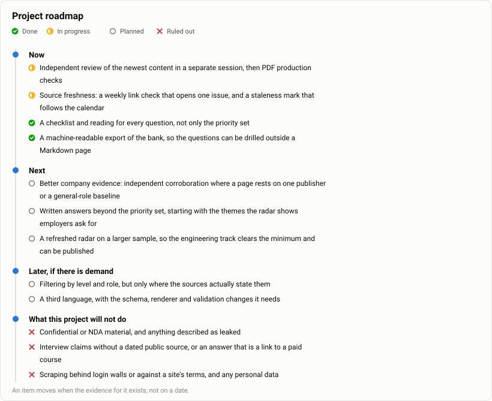

# Roadmap

[English](ROADMAP.md) · [Русский](ru/ROADMAP.md) · [AI Interview Atlas](../README.md)

What this repository plans to improve next, and what it will not do. This is the project's development roadmap, not a personal interview-preparation schedule; for practice, start with either track's *Start here* page. There are no delivery dates here on purpose: an item moves when the evidence for it exists, not when a calendar says it should.

<picture>
  <source media="(prefers-color-scheme: dark)" srcset="assets/roadmap.en.dark.svg">
  
</picture>

## Where the atlas is today

As of 2026-10-05:

- 306 questions across 17 themes, all with EN/RU checklists and reading.
- 165 priority questions with answers in both languages: 86 Engineering and 80 Leadership. The original priority order is retained; the seven newest are editorial practice questions, marked 🧪, on context budgets, platform tenancy, model deprecation, cost attribution, platform service levels, adversarial testing and measuring an AI coding rollout.
- 29 company pages. Amazon now includes an official general TPM process alongside its separate secondary AI-PM path; general-role evidence does not establish a specialist AI loop.
- 247 sources with recorded reading dates and publication dates when established.
- The unchanged requirements radar over 79 September 2026 postings.
- Generated figures for the postings radar, the evidence behind the atlas, coverage by theme and this roadmap, each drawn for a light and a dark surface.
- A machine-readable export of the bank (`scripts/build.py --export`), validated against its own published schema.
- A question-led learning roadmap and specialised Engineering and four-branch Leadership guides. These provide explanations, checks and reading; no Python exercise package, labs or automated evaluator was added.

The contribution workflow requires schema/provenance validation, language and link checks, privacy checks and independent content review. Mechanical checks do not establish factual accuracy or publication approval. Earlier answer reviews apply to their dated versions; the new and revised October 5 content requires its own separate-session review.

Retained local manifests and matching PDF hashes establish 2026-10-02 builds of all four books: main editions of 236 English and 258 Russian pages, and answers editions of 72 and 87 pages. These predate the current content. They establish neither visual QA nor publication of a new edition; the [releases page](https://github.com/eiler2005/ai-interview-atlas/releases/latest) identifies published assets.

## Next

- **Independent content review and PDF production checks.** Review the exact October 5 content in a separate session, resolve findings, then verify the deliverables before a maintainer release decision. The October 2 PDF manifests do not cover this expansion. Answers are examples of reasoning, not reference answers.
- **Curriculum expansion.** *Content added; review remains separate.* The [expansion plan](plans/ATLAS_EXPANSION.md), [coverage audit](research/ATLAS_COVERAGE_AUDIT.md) and [Leadership audit](research/LEADERSHIP_AUDIT.md) separate current evidence from educational gaps. The [learning roadmap](LEARNING_ROADMAP.md) connects the existing eight-week baseline to specialised guides. Leadership has four explicit branches and five new editorial bank questions on portfolio allocation, vendor exit, management through managers, stopping investment and an incident without rollback; these do not establish new employer interview claims.
- **Checklists beyond the priority set.** *Done.* Every question now says what a strong answer covers and lists reading. Written answers remain limited to the priority questions.
- **Better company evidence and more companies.** *Planned.* Seek independent corroboration and specialist AI evidence where current pages have only general-role baselines or limited public evidence. The current 29 are not a ranking and have not all cleared a two-independent-source threshold. As the [methodology](METHODOLOGY.md) explains, each claim carries its own evidence marker; two documents from one publisher do not count as independent corroboration.
- **Source freshness.** *In progress.* A weekly job now checks that cited URLs still resolve (sites that block automated checks are skipped) and keeps one issue listing the failures; a failing link is a prompt to re-read the source, not proof that the claim is wrong. Company pages already mark a review date more than a year older than the newest content; the mark should also follow the calendar, not only newer content. Interview loops change, and a page that quietly ages is worse than one that admits it.

## After that

- **Written answers beyond the priority set**, starting with the themes the radar shows employers ask for most.
- **A refreshed radar** on a newer and larger sample. The engineering track is suppressed today because 17 postings is below the minimum of 20 the method requires; a larger sample would publish it.
- **Filtering by level and role** — junior, senior, staff, manager, director — but only where the sources actually say which level a question was asked at. Guessing would defeat the point of the provenance model.

## Later, if there is demand

- A third language, with the necessary schema, renderer and validation changes as well as translation.
- Practice tools built on the export: a random-question page on the site, or a flashcard deck. The data is there; the tools are not, and they are only worth building if people ask for them.

## What this project will not do

- **No confidential or NDA material, and nothing described as leaked.** Everything here comes from public sources, and a report from someone who says they were under an agreement is not used.
- **No unattributed interview claims.** A question is either backed by a public source with a recorded reading date and publication date when known, or marked as generated from published radar themes. The marker is visible on the page; a reading date does not establish when an interview happened.
- **No answers that are a link to a paid course.** The answer is on the page.
- **No scraping behind login walls, CAPTCHA or against a site's terms.**
- **No personal data.** No candidate facts, CVs, private notes or company-attributed data from anyone's private job search. The radar is an anonymised aggregate with a minimum cell size, and it is the only private input.

## How to help

[CONTRIBUTING](../CONTRIBUTING.md) has the full process. The three most useful contributions right now:

1. A dated first-hand account of a loop stage that a company page currently marks as an assumption.
2. A correction to an answer or a checklist, with the source that shows it.
3. Wording fixes in either language — the English and the Russian are meant to say the same thing, and where they do not, that is a bug.
