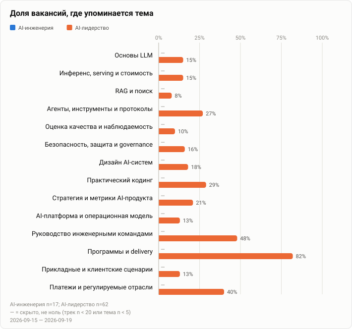

<!-- Generated by scripts/build.py from src/content. Edit the YAML, not this file. -->
# Радар требований

[English](../radar.md) · Русский · ← [AI Interview Atlas](../../README.ru.md)

- **Период:** 2026-09-15 — 2026-09-19
- **Выборка:** 79 вакансий: инженерия — 17, лидерство — 62; рынки: международный — 79, Россия — 0, не указан — 0

| Тема | AI-инженерия | AI-лидерство |
| --- | ---: | ---: |
| [Основы LLM](themes/llm-fundamentals.md) | — | 15% (9) |
| [Инференс, serving и стоимость](themes/inference-economics.md) | — | 15% (9) |
| [RAG и поиск](themes/rag-retrieval.md) | — | 8% (5) |
| [Агенты, инструменты и протоколы](themes/agents-tools.md) | — | 27% (17) |
| [Оценка качества и наблюдаемость](themes/evals-observability.md) | — | 10% (6) |
| [Безопасность, защита и governance](themes/safety-security-governance.md) | — | 16% (10) |
| [Дизайн AI-систем](themes/ai-system-design.md) | — | 18% (11) |
| [Практический кодинг](themes/coding-practical.md) | — | 29% (18) |
| [Стратегия и метрики AI-продукта](themes/ai-product-strategy.md) | — | 21% (13) |
| [AI-платформа и операционная модель](themes/ai-operating-model.md) | — | 13% (8) |
| [Руководство инженерными командами](themes/engineering-leadership.md) | — | 48% (30) |
| [Программы и delivery](themes/program-delivery.md) | — | 82% (51) |
| [Прикладные и клиентские сценарии](themes/applied-scenarios.md) | — | 13% (8) |
| [Платежи и регулируемые отрасли](themes/domain-payments-fintech.md) | — | 40% (25) |

Вакансии трека «лидерство» в выборке: сама роль связана с AI или машинным обучением в 42% (26 из 62).

Прочерк: тему упоминают меньше 5 вакансий или в треке меньше 20 вакансий; такие ячейки не публикуются.

## Методика

79 публичных вакансий с полным текстом на старшие роли в продукте, инженерии и управлении программами, впервые замеченных 2026-09-15 – 2026-09-19 на карьерных сайтах работодателей и job-бордах в ходе одного поиска работы; дубликаты по работодателю и названию убраны. Трек определяется по названию должности; содержание проверено, чтобы исключить функции за рамками исследования. Дизайн, маркетинг, продажи и похожие функции исключены. Claude Sonnet 5 классифицировала первые 60 вакансий, GPT Astra завершила оставшуюся часть по критериям ниже; для каждой отмеченной темы сохранена цитата. GPT Astra сверила с полным текстом воспроизводимую случайную выборку из восьми оставшихся вакансий и отмеченные спорные случаи. Записи об авторстве и проверке сохранены приватно. Вакансия учитывается в теме один раз. «Сама роль связана с AI» означает, что роль отвечает за AI/ML-продукты, функции, модели, команды или инфраструктуру; использование AI-инструментов не считается. В выборке больше международного финтеха и B2B-софта; это не обзор рынка. В этом выпуске слишком мало инженерных вакансий, поэтому этот трек не публикуется.

### Что засчитывается в каждой теме

- **Основы LLM:** опыт работы с LLM, генеративным AI или foundation-моделями либо их знание
- **Инференс, serving и стоимость:** serving, инференс или GPU-инфраструктура для AI/ML, задержка и стоимость AI-нагрузок
- **RAG и поиск:** RAG, семантический или векторный поиск, эмбеддинги
- **Агенты, инструменты и протоколы:** AI-агенты, агентные процессы, вызов инструментов или протоколы вроде MCP
- **Дообучение и post-training:** обучение или дообучение ML-моделей
- **Оценка качества и наблюдаемость:** оценка, тестирование или мониторинг качества AI/ML-систем
- **Безопасность, защита и governance:** ответственный AI, риски и регулирование AI, безопасность AI-систем; общая безопасность или финансовый комплаенс без AI не считаются
- **Мультимодальность и голос:** речь, компьютерное зрение или мультимодальный AI
- **Дизайн AI-систем:** проектирование архитектуры AI/ML-систем или платформ; архитектура обычного софта не считается
- **Практический кодинг:** написание кода в роли или владение конкретным языком программирования
- **Стратегия и метрики AI-продукта:** стратегия, роадмап, метрики или бизнес-кейс AI/ML-продуктов и функций; общая продуктовая стратегия не считается
- **AI-платформа и операционная модель:** внутренние AI-платформы, внедрение AI в организации, обучение и поддержка команд
- **Руководство инженерными командами:** руководство инженерами или руководителями: найм, развитие, результативность, устройство команд и организации
- **Программы и delivery:** руководство межкомандной доставкой: роадмапы, планирование, зависимости, запуски и исполнение
- **Прикладные и клиентские сценарии:** техническое внедрение у клиентов: forward-deployed, solutions-работа и пилоты
- **Платежи и регулируемые отрасли:** опыт в платежах, банкинге, кредитовании, страховании, финтехе или финансовом регулировании
